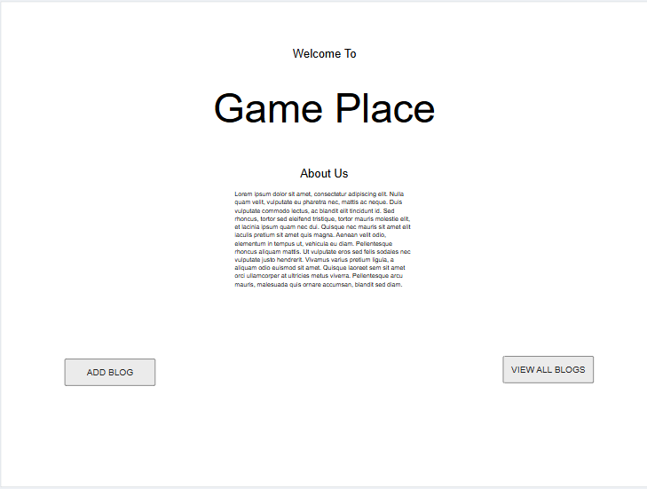
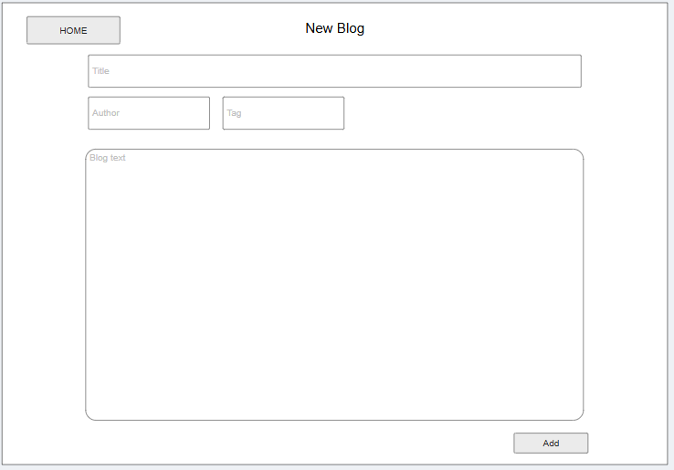
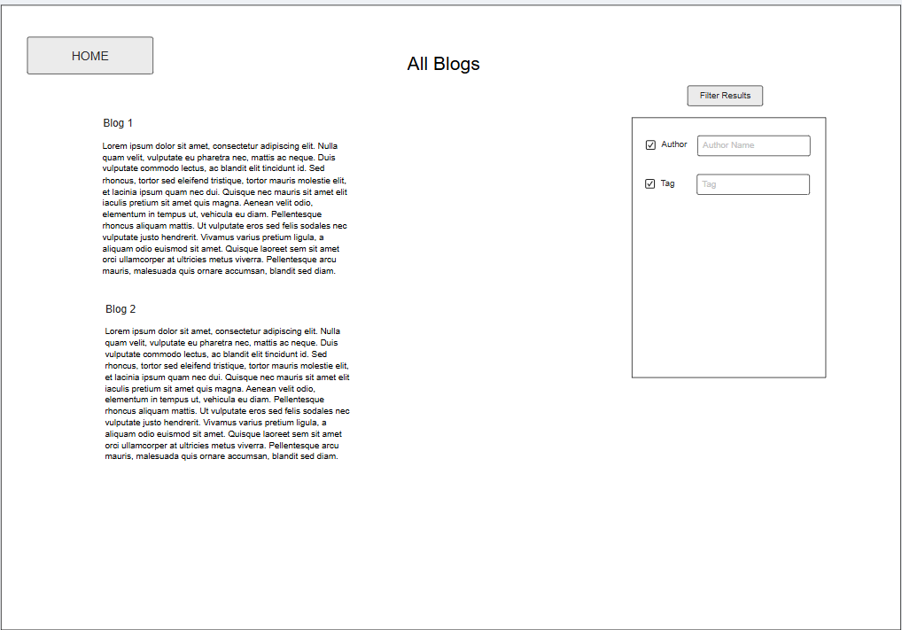
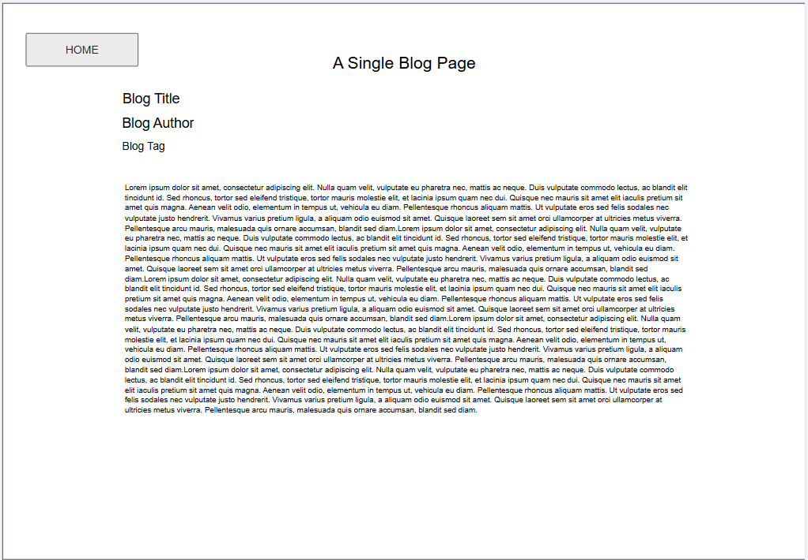

# Web Dev Starter Code

## Project Spec

For my final project I want to create a simple collaborative blog site dedicated to video games. While most blog websites are more like personal online journals that only one person updates. I instead want my site to be a collaborative blog website that allows anyone to post a blog. I feel like this design choice will make the site more engaging and create a place that allows those that would like to post their thoughts and opinions in a blog format but don't want to make a dedicated personal blog page themselves. The website will provide a space that encourages expression, where people can easily discuss their favorite games and discover new ones based on others’ recommendations. By allowing anyone to post a blog the website will be able to unite gamers of types by providing a collaborative and inclusive blog experience.

The main goal of this site would be to create a space for gamers regardless of what type of games they enjoy to post blogs about games they are interested in. Along with allowing them to read what other people are saying about games they like to play. It will be a place that draws in people regardless of what games they love. As a result it will allow people to see what is trending in the video game industry

That being said the target audience for this site would be gamers in general that want a place to post their thoughts and opinions for others to read. More specifically the target audience would be gamers that want a safe place to express themselves where everyone feels welcome to share without the worry that they are not part of the community. The target audience will also be those that don’t necessarily want to post anything but just want to read about what is going on in the world of video games.

The main functionality of the website will be to allow users to add a new blog post, see all blog posts summarized on a single page, click on a post for more details and filter blog posts by author name and tag. When creating a new blog post the data a user would need to enter would be their name, any tags they would like to associate with the post such as the specific game they are talking about and the blog content itself. This simple formatt will make adding a new post easy and seamless. When viewing all the blog posts a user will be able to filter posts by author name and by any tags. This will help users filter down to only posts they are interested in.

The data that will be collected and managed will be any data regarding the blog post. Such as the author's name, any tags associated with the post, and the content of the post itself.

Stretch Goals
* Ability to add comments to a blog post
* Support Markdown for more styling options 
* Allow users to log in and see “All my Post”
* Bookmark or Save Posts

## Project Wireframe

Landing Page:

New Blog Page:

All Blogs Page:

Single Blog Page:

